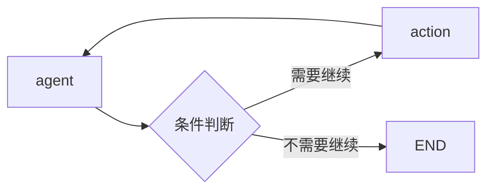

最近AI Agent越来越火，LangChain生态也在快速迭代。如果你用过一些简单的Chain，但是面对复杂的多Agent编排感觉力不从心，那你一定要认识一下LangGraph-——它正是Langchain官方推出的图编排框架。

今天这篇我们从最基础开始：LangGraph的核心概念有哪些？它和我们熟悉的 LangChain 又是什么关系？

# 01 LangGraph是什么？和LangChain的关系？

先理清楚关系：

LangChain是一个大的生态系统，提供了LLM应用开发的基础组件（Prompt、Chain、VectorStore等等）

LangGraph是LangChain生态中的一个**图编排框架**，专门用来构建**有状态、多步骤、可循环**的Agent应用。

LangGraph不是要取代 LangChain，它是**LangChain 的扩展** —— 在 LangChain 提供的基础组件之上，给了你更灵活的编排方式。

# 02 为什么需要 "Graph"？普通 Chain 不够用吗？

这是一个好问题。LangChain 原生的 Chain 已经能做很多事情了，为什么还要搞个 Graph？

我们先看看普通 Chain 的局限性：

|    特性    | 普通chain  | LangGraph  |
| :------: | :------: | :--------: |
|   执行流程   |  线性顺序执行  |   任意拓扑结构   |
|   循环支持   | 需要手动hack |  原生支持条件循环  |
|   状态管理   |  无持久化状态  | 内置持久化状态管理  |
| 多Agent协作 |  支持但很笨重  | 原生支持多个节点协作 |
|   条件分支   |  支持但不灵活  | 边就是条件，非常清晰 |
说白了：

如果你只是做 "Prompt → LLM → 输出" 这种简单任务，普通 Chain 足够了
如果你要做 **Agent 思考循环**（思考 → 行动 → 观察 → 再思考）、**多 Agent 协作**、**复杂条件分支**，那 Graph 是更自然的表达方式


# 03 LangGraph 的三大核心概念

LangGraph其实就三个核心概念，搞懂了你就入门了：**State**、**Node**、**Edge**。

## State——整个图的共享状态

State 就是存储在Graph中的**共享数据结构**，所有Node都可以读写State。这是 LangGraph 最关键的设计 —— 有了共享 State，多个 Node 之间才能协作。

举个最简单的例子，一个问答 Agent 的 State 可能长这样：

```python
state = {
    question:"用户的问题是什么",
    answer:"生成的答案"，
    steps:["已经执行了哪些步骤"]，
    shouldContinue:true //是否继续循环
}
```

State的特点：

- **类型安全**：可以给 State 定义完整的类型
- **可合并**：每个 Node 返回的部分 State 会自动合并进全局 State
- **可持久化**: State 可以被保存到数据库，中断了再恢复

## Node —— 执行单元，就是一个函数

Node 就是图中的**一个执行节点**，本质上就是一个**接收 State 返回新 State 的异步函数**。

```python
async def my_node(state):
      #从state读数据
      question = state["question"]
      
      #做一些处理，调用llm,工具、查询数据库
      answer = await llm.ainvoke(question) #异步调用
      
      #返回新的状态片段，会自动合并到全局State
      return { answer:answer };
```

Node 可以做任何事情：

- 调用 LLM 生成文本
    
- 调用外部工具 API
    
- 查询向量数据库
    
- 调用另一个 Agent
    
- 做条件判断
    

简单、灵活，这就是 Node 的设计哲学。

## Edge —— 连接节点，定义流向

Edge负责定义**节点之间的流向**，告诉Graph执行完这个Node之后下一步该去哪。

Edge分两种：

**1、普通边——固定流向**
```python
graph.add_edge('A','B')
```

**2. 条件边 —— 根据 State 动态决定去向**
```python
from langgraph.graph import END
graph.add_contional_edges(
        "agent"
        lambda state: "continue" if state[shouldcontinue] else END
        )
```

条件边就是 LangGraph 能做循环和分支的关键。比如 Agent 的 "思考 → 行动 → 再思考" 循环，就是用条件边实现的：



## 04 一个最小可运行例子

话不多说，给一个最简的例子感受一下这三个概念怎么配合：

```python
from langgraph.graph import StateGraph,END
from typing import TypedDict,Optional
import asyncio

#1、定义State类型
class AgentState(TypedDict):
      input:str
      output:Optional[str]  # 初始为 None，之后赋值
      
#2、定义一个Node
async def greetingNode(state:AgentState):
      output = state['input']
      return {"output":output}
      
#3、创建图
graph = StateGraph(AgentState)

#4、添加节点和边
graph.add_node("greetiing",greetingNode)
graph.set_entry_point("greeting")
graph.add_edge("greeting",END)

#5、编译运行
app = graph.compile()
async def main():
    result = await app.ainvoke({input:“世界”})
    print(result["output"])
    
if __name__=="__main__":
     asynico.run(main())
```

看，就这么点代码，一个最简单的 Graph 就跑起来了。三个核心概念都用到了：

- **State**：`AgentState` 定义了输入输出
    
- **Node**：`greetingNode` 就是我们的处理节点
    
- **Edge**：`greetingNode` → `END`，执行完就结束

## 05 总结一下

|  概念   |   作用   |            本质             |
| :---: | :----: | :-----------------------: |
| State | 存储共享数据 |        全局可读写的状态对象         |
| Node  | 执行具体逻辑 | 一个接收 State 返回 State 的异步函数 |
| Edge  | 控制执行流向 |    定义节点之间的跳转关系，支持条件判断     |

LangGraph 在 LangChain 的基础上，给了我们：

1. **更灵活**的执行流程控制 —— 不再局限于线性
    
2. **更清晰**的多 Agent 协作模型 —— 每个 Agent 就是一个 Node
    
3. **原生支持**循环和条件分支 —— 这正是 Agent 思考循环需要的
    

所以回到最开始的问题：**什么时候该用 LangGraph？**

- 如果你的应用是简单的一问一答 → 用普通 LangChain Chain 就行
    
- 如果你需要构建有状态、多步骤、多 Agent 协作的复杂 AI 应用 → 选 LangGraph 肯定没错